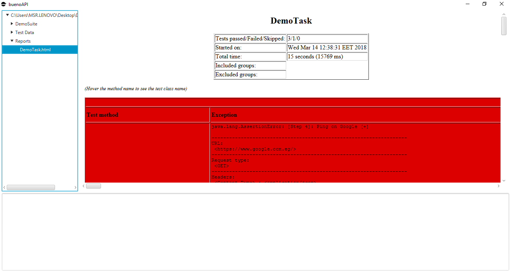

# buenoAPI

### buenoAPI test automation tool in points
1. Open source
2. Supports Windows and Ubuntu
3. JavaFX to implement awesome interface
4. Based on Rest-Assured, TestNG and Jxl
5. Supports REST/SOAP webservices test automation
6. Can handle correlated webservices
7. Data-Driven tool
8. Tasks parallel execution can be done by simple configuration
9. Generates pie charts showing each project status and html reports showing each test cases status (Passed/Failed)
10. Can be integrated with Jira to log bugs automatically as soon as any test case fails
11. Generates logs on the execution runtime to monitor tool status continuously

### buenoAPI main five components

1. Root: which contains all project files
2. Test Data: in which the automation tester can load all XLS files they need to be reused all over the project.

3. Test Suite: project can be divided into test suites to be more organized. Test suite is the smallest project component to be executed and to be integrated with Jira. For each test suite, two parameters should be set, the first called `Threads` which helps the parallel execution in case number of threads is more than one, the second called `Verbose` which indicates how much details of test suite execution on logs section. In case Jira integration is enabled, you must set more parameters related to your Jira account and project. Lets have a look on them:
  - `Domain`: Jira domain
  - `Email`: Jira account email
  - `Password`: Jira account password. Email and password are required to authenticate to Jira account
  - `Issue Type`: Bug/Task/Subtask
  - `Project key`: in which project of Jira account to log bugs
  - `Priority`: Bug priority to be set

4. Task: Under each test suite, there are one or more tasks. Tasks are the main buenoAPI scripts since they refer to test data which can be executed. Each task has two parameters to be set, Excel file and the relevant Excel sheet.

5. Reports: As soon as execution is done, two types of reports are automatically generated. The first type is pie-chart showing the whole project status in terms of number of passed/failed test cases. The second type is more detailed reports which are customized version of html TestNG reports. Each task has its html report showing why each step in your test case is failed.

* NOTE: Logging bugs to Jira is done only in case at least on test case is failed. In other words, in case no test cases are failed, no bugs would be logged into Jira even thought Jira integration is enabled. If you disable Jira integration, no bugs are logged into Jira even if some test cases are failed.

### buenoAPI simple demo

1. Click on buenoAPI executable file

2. In welcome screen, you can Create new project or import project which you created before

3. Create new project by selecting directory to save the project.

4. Project is created. buenoAPI project screen is displayed with the main 5 components discussed before.

5. Test Data and Reports components are empty since no XLS files are loaded nor test suites are executed.

6. Load test data:
 - Navigate to "Test Data" page by clicking on *Test Data*
 
 
 - Click browse to select XLS files
 
 
 - XLS files are loaded successfully
 
 

7. Create *Test Suite*:
 - Right click on Root node > Add
 

 - Enter test suite name (i.e. DemoSuite) > Ok
 

8. Add suite parameters without Jira integration:
 - Set `Verbose` to 3
 - Set `Threads` to 1
 

10. Add suite parameters without Jira integration:
 - Set `Verbose` to 3
 - Set `Threads` to 1
 - Enable `Jira` check box
 - Set Jira `Jira Domian`
 - Set your `Jira Email`
 - Set your `Jira Password`
 - Set `Project Key`
 - Set `Issue Type`
 - Set `Priority`
 

11. Save *Test Suite*
 - Right click on created test suite
 - Click on Save in the menu

12. Add *Task* under *Test Suite*
 - Right click on *Test Suite* > Click Add in the menu
 
 
 - Enter *Task* name (i.e. Task) > Ok
 - Task is created

13. Add Task parameters
 - Set `Excel File` to one of XLS files imported in the project
 - Set `Excel Sheet` to sheet name in the selected XLS file
 - Right click on *Task* > Save
 
 
 
14. Execution 
 - Navigate to *Test Suite* you want to be executed
 - Click on *Start Green Arrow* button
 - Test suite execution is logged in Logs section at the bottom of the screen
 - Wait till the execution is Done

15. Reports
 - As soon as execution is done, *Reports* repository is no longer empty. Each *Task* has its own html reports and pie-chart is generated showing the whole project status.
 - Click on *Reports* to display the pie-chart
 
 
 - Click on Task under *Reports* to display html report per this task
 

16. In case `Jira integration` check box is enabled, you can navigate to your Jira account to check logged Bugs

